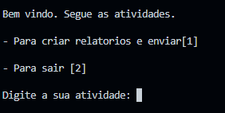
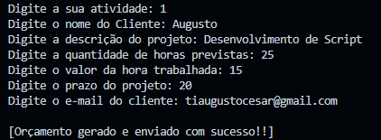
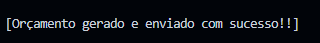

# 📄 Gerador de Orçamento em Python

Este projeto foi desenvolvido durante um workshop de Python realizado pela instituição educacional [EmpowerData](https://www.empowerdata.com.br/).

## 🎯 Objetivo

O objetivo deste projeto é criar um sistema que automaticamente gera orçamentos em formato PDF utilizando a linguagem Python, com o auxílio da biblioteca fpdf. Também foi incluído um algoritmo utilizando a biblioteca smtplib para enviar o orçamento automaticamente via e-mail.

## 🛠️ Tecnologias Utilizadas

- [Python](https://www.python.org)
- [Jupyter Notebook](https://www.jupyter.org)
- [fpdf library](https://pyfpdf.readthedocs.io)
- [smtplib](https://docs.python.org/3/library/smtplib.html)

## ℹ️ Como Instalar

O funcionamento do script é simples e direto. Veja os passos abaixo:

1. Clone o repositório:

```shell
$ git clone https://github.com/zSantz/Gerador-de-PDF-Python.git
```

2. Após clonar, acesse a pasta do projeto e execute o script:

```shell
Copy code
$ cd Gerador-de-PDF-Python

$ python ./main.py
```

## Como utilizar 🚀
### Funcionalidades Técnicas 🔧
O script todo funciona dentro de uma estrutura de repetição while, para melhorar a interação dos usuários. Foram utilizadas as bibliotecas smtp para enviar automaticamente os e-mails via SMTP, e o fpdf para criação do PDF.

### Utilização correta 📝
> Observação: Antes de qualquer coisa, você deve alterar as seguintes linhas de código e inserir as informações do seu servidor SMTP:
>
> from_address = 'you_email'
>
> smtp_server = 'smtp_Server_link'
>
> smtp_port = 'your_port'
>
> smtp_username = 'user'
>
> smtp_password = 'password'

1. Quando o script for executado, ele irá entrar diretamente no menu de opções. Digite um número inteiro de 1 a 2 para escolher sua ação.



2. Ao selecionar sua atividade, no caso a criação de relatórios, você receberá as seguintes entradas de dados. Segue o exemplo:



3. Se tudo der certo, você receberá a mensagem.



#### 🚀 Melhorias Futuras
Preciso de dicas para melhorar. Talvez integrar um bot diretamente no Whatsapp? Ou alterar a forma de envio de e-mail? Não sei, preciso de dicas.